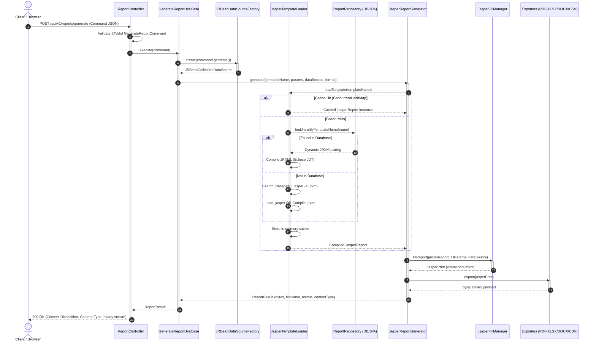
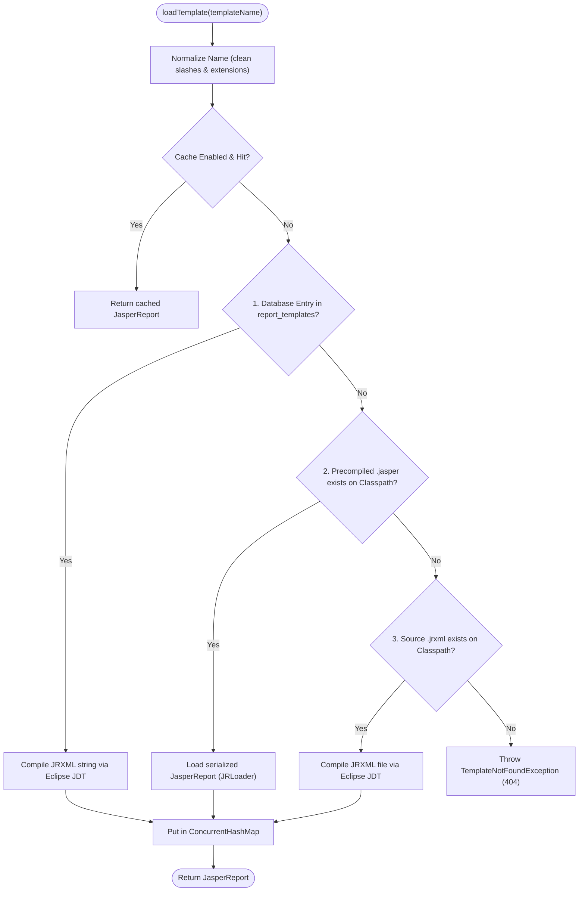
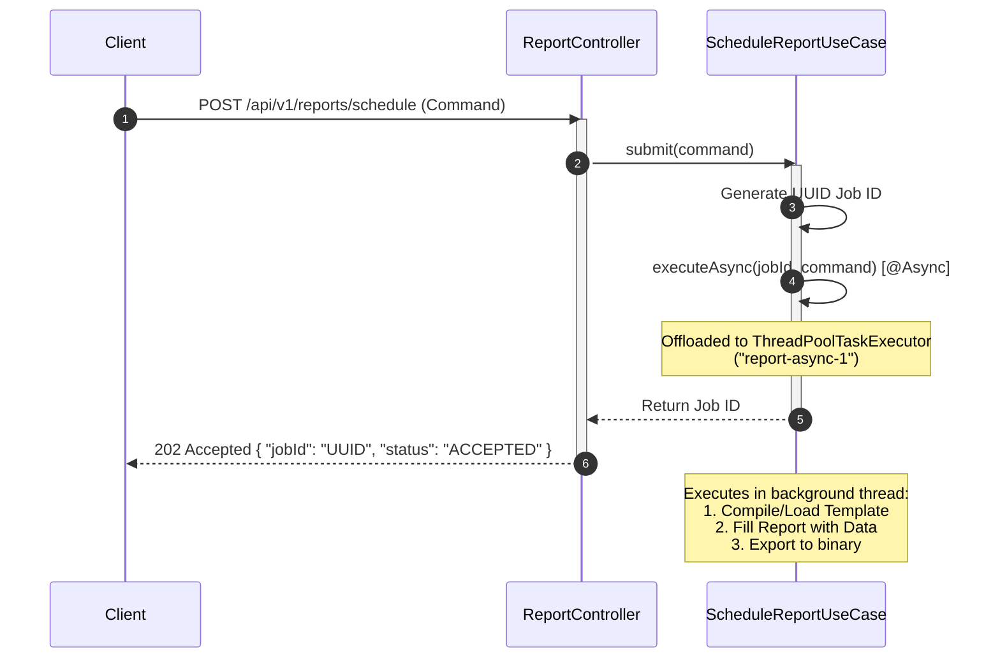

# Aureum Grand Report Service — Complete End-to-End Process Guide

> **Project:** Aureum Grand Report Service  
> **Stack:** Spring Boot 3.4.0 • Java 21 • JasperReports 7.0.8 • Apache POI 5.2.5 • Jakarta Persistence (H2/JPA)  
> **Architecture:** Clean Architecture (Domain • Application • Infrastructure • Presentation)  
> **Document Purpose:** Complete technical reference and lifecycle guide for developers, system architects, and operations.

---

## 1. Executive Summary & Architecture Philosophy

The **Aureum Grand Report Service** is an enterprise-grade reporting microservice designed for high-concurrency hotel operations, invoicing, folios, and sales reporting. Built around **JasperReports 7.0.8** and **Spring Boot 3.4.0**, it enforces strict **Clean Architecture (Hexagonal / Ports and Adapters)** principles to ensure:

- **Format Agnosticism:** Core business use cases know nothing about PDF, Excel, Word, or CSV export mechanics.
- **Data Source Decoupling:** Business domain logic is decoupled from raw databases, JSON APIs, or Java Bean collections.
- **Engine Isolation:** The JasperReports library is treated as an infrastructure detail behind domain ports (`ReportGenerator`, `ReportRepository`).
- **Khmer Unicode Compatibility:** Native font embedding ensures Khmer script renders with 100% typographic fidelity across all exported media without square boxes or missing glyphs.
- **Dual-Mode Execution:** Supports both synchronous generation/preview and non-blocking asynchronous batch jobs.

```
                  +----------------------------------------------------+
                  |               PRESENTATION LAYER                   |
                  |  ReportController  •  GlobalExceptionHandler       |
                  +-------------------------+--------------------------+
                                            |
                                            v
                  +----------------------------------------------------+
                  |               APPLICATION LAYER                    |
                  |  GenerateReportUseCase • PreviewReportUseCase      |
                  |  ScheduleReportUseCase • Command / DTO Mappings    |
                  +--------------------+----+--------------------------+
                                       |    ^
                                       |    |
                                       v    | implements
                  +--------------------+----+--------------------------+
                  |                 DOMAIN LAYER                       |
                  |  Models: ReportRequest, ReportResult, ReportFormat |
                  |  Ports:  ReportGenerator, ReportRepository         |
                  |  Exceptions: TemplateNotFound, ReportGeneration    |
                  +--------------------+-------------------------------+
                                       ^
                                       | implements
                  +--------------------+-------------------------------+
                  |             INFRASTRUCTURE LAYER                   |
                  |  JasperReportGenerator  •  JasperTemplateLoader    |
                  |  Exporters: Pdf, Xlsx, Docx, Csv                   |
                  |  DataSources: JRBean, JRJdbc                       |
                  |  Persistence: ReportTemplateJpaRepository          |
                  |  Config: JasperConfig (ThreadPoolTaskExecutor)     |
                  +----------------------------------------------------+
```

---

## 2. End-to-End Process Lifecycle

The report lifecycle follows a 7-phase execution pipeline from client HTTP request to output byte stream.



---

## 3. The 7 Phases of the Generation Pipeline

### Phase 1: Request Ingestion & Command Validation
1. The client sends a `POST` request to `/api/v1/reports/generate`, `/api/v1/reports/preview`, or `/api/v1/reports/schedule`.
2. Spring's `MappingJackson2HttpMessageConverter` deserializes the JSON body into a [GenerateReportCommand](file:///D:/TD%20System/Report/src/main/java/com/aureumgrand/report/application/dto/GenerateReportCommand.java).
3. Bean Validation (`@Valid`) checks mandatory fields (e.g., `@NotBlank` on `templateName`).
4. If validation fails, [GlobalExceptionHandler](file:///D:/TD%20System/Report/src/main/java/com/aureumgrand/report/presentation/rest/advice/GlobalExceptionHandler.java) intercepts `MethodArgumentNotValidException` and returns a `400 Bad Request` with field-level details.

### Phase 2: Application Use Case Orchestration
The controller delegates directly to one of three specialized use cases:
- **[GenerateReportUseCase](file:///D:/TD%20System/Report/src/main/java/com/aureumgrand/report/application/usecase/GenerateReportUseCase.java):** Standard synchronous generation. Parses the target [ReportFormat](file:///D:/TD%20System/Report/src/main/java/com/aureumgrand/report/domain/model/ReportFormat.java) (PDF, XLSX, DOCX, CSV) and prepares parameters.
- **[PreviewReportUseCase](file:///D:/TD%20System/Report/src/main/java/com/aureumgrand/report/application/usecase/PreviewReportUseCase.java):** Overrides format strictly to `PDF` and signals the controller to set `Content-Disposition: inline` for immediate in-browser rendering.
- **[ScheduleReportUseCase](file:///D:/TD%20System/Report/src/main/java/com/aureumgrand/report/application/usecase/ScheduleReportUseCase.java):** Returns a generated `jobId` (UUID) with `202 Accepted`, then offloads execution to Spring's background worker pool.

### Phase 3: Data Source Synthesis
The use case converts incoming collection items (`ReportDataDto`) into a JasperReports-compatible data source:
- If items are present: [JRBeanDataSourceFactory](file:///D:/TD%20System/Report/src/main/java/com/aureumgrand/report/infrastructure/jasper/datasource/JRBeanDataSourceFactory.java) wraps the list into a `JRBeanCollectionDataSource(items, false)`.
- If no items exist: A `JREmptyDataSource` is returned.
- Subreport injection: Data sources are duplicated into parameters (`ItemDataSource`, `testData`) so nested subreports or tables can iterate over the items independently.

### Phase 4: Multi-Tiered Template Resolution & Compilation
The infrastructure component [JasperTemplateLoader](file:///D:/TD%20System/Report/src/main/java/com/aureumgrand/report/infrastructure/jasper/JasperTemplateLoader.java) resolves the requested template following a prioritized 4-stage search:



> [!TIP]
> **Performance Recommendation:** Precompiling `.jrxml` to `.jasper` at build time or relying on the in-memory cache completely bypasses the Eclipse JDT compiler, reducing generation latency by **85–95%**.

### Phase 5: Document Filling (`JasperFillManager`)
In [JasperReportGenerator](file:///D:/TD%20System/Report/src/main/java/com/aureumgrand/report/infrastructure/jasper/JasperReportGenerator.java):
```java
JasperPrint jasperPrint = JasperFillManager.fillReport(jasperReport, fillParameters, effectiveDataSource);
```
- The compiled template structure is merged with runtime parameters (`Map<String, Object>`) and row data (`JRDataSource`).
- Calculations (like subtotals, tax rates, grand totals, and page numbering) are evaluated.
- The output is an in-memory `JasperPrint` object representing the rendered document pages.

### Phase 6: Multi-Format Exporting
The `JasperPrint` instance is passed to the appropriate format exporter:
- **PDF:** [PdfExporter](file:///D:/TD%20System/Report/src/main/java/com/aureumgrand/report/infrastructure/jasper/exporter/PdfExporter.java) (`JRPdfExporter`) with embedded TrueType fonts.
- **Excel:** [XlsxExporter](file:///D:/TD%20System/Report/src/main/java/com/aureumgrand/report/infrastructure/jasper/exporter/XlsxExporter.java) (`JRXlsxExporter`) via Apache POI 5.2.5.
- **Word:** [DocxExporter](file:///D:/TD%20System/Report/src/main/java/com/aureumgrand/report/infrastructure/jasper/exporter/DocxExporter.java) (`JRDocxExporter`) via Apache POI 5.2.5.
- **CSV:** [CsvExporter](file:///D:/TD%20System/Report/src/main/java/com/aureumgrand/report/infrastructure/jasper/exporter/CsvExporter.java) (`JRCsvExporter`) using standard UTF-8 character encoding.

### Phase 7: HTTP Response Assembly
The [ReportController](file:///D:/TD%20System/Report/src/main/java/com/aureumgrand/report/presentation/rest/ReportController.java) packages the binary `byte[]` into a Spring `ResponseEntity`:
- **Content-Type:** Matches MIME type (`application/pdf`, `application/vnd.openxmlformats-officedocument.spreadsheetml.sheet`, etc.).
- **Content-Disposition:**
  - `attachment; filename="Invoice_INV-2026-0001.pdf"` (triggers client download).
  - `inline; filename="invoice_template.pdf"` (renders inside browser tab for preview).
- **Content-Length:** Set explicitly to the exact byte array length for progress tracking.

---

## 4. Architectural Layers & Class Responsibilities

| Layer | Package / Class | Responsibility |
| :--- | :--- | :--- |
| **Domain** | [ReportFormat](file:///D:/TD%20System/Report/src/main/java/com/aureumgrand/report/domain/model/ReportFormat.java) | Enum defining supported formats (`PDF`, `XLSX`, `DOCX`, `CSV`), MIME types, and file extensions. |
| **Domain** | [ReportResult](file:///D:/TD%20System/Report/src/main/java/com/aureumgrand/report/domain/model/ReportResult.java) | Immutable value object carrying output bytes, calculated filename, content type, and byte size. |
| **Domain** | [ReportGenerator](file:///D:/TD%20System/Report/src/main/java/com/aureumgrand/report/domain/port/ReportGenerator.java) | Outbound port interface for generating reports from templates and datasources. |
| **Domain** | [ReportRepository](file:///D:/TD%20System/Report/src/main/java/com/aureumgrand/report/domain/port/ReportRepository.java) | Outbound port interface for retrieving dynamic JRXML templates stored in a database. |
| **Domain** | [TemplateNotFoundException](file:///D:/TD%20System/Report/src/main/java/com/aureumgrand/report/domain/exception/TemplateNotFoundException.java) | Domain exception thrown when a requested report template cannot be resolved anywhere. |
| **Domain** | [ReportGenerationException](file:///D:/TD%20System/Report/src/main/java/com/aureumgrand/report/domain/exception/ReportGenerationException.java) | Domain exception wrapping compilation, filling, or export failures. |
| **Application** | [GenerateReportCommand](file:///D:/TD%20System/Report/src/main/java/com/aureumgrand/report/application/dto/GenerateReportCommand.java) | Input DTO encapsulating template name, format, parameter map, and line items. |
| **Application** | [ReportDataDto](file:///D:/TD%20System/Report/src/main/java/com/aureumgrand/report/application/dto/ReportDataDto.java) | Generic line item DTO (item code, description, quantity, price, amount, date, category). |
| **Application** | [GenerateReportUseCase](file:///D:/TD%20System/Report/src/main/java/com/aureumgrand/report/application/usecase/GenerateReportUseCase.java) | Primary workflow orchestrator: validates input, builds data sources, and calls generator port. |
| **Application** | [PreviewReportUseCase](file:///D:/TD%20System/Report/src/main/java/com/aureumgrand/report/application/usecase/PreviewReportUseCase.java) | Specialization use case forcing PDF output for browser preview. |
| **Application** | [ScheduleReportUseCase](file:///D:/TD%20System/Report/src/main/java/com/aureumgrand/report/application/usecase/ScheduleReportUseCase.java) | Asynchronous orchestrator executing generation on background threads via `@Async`. |
| **Infrastructure**| [JasperReportGenerator](file:///D:/TD%20System/Report/src/main/java/com/aureumgrand/report/infrastructure/jasper/JasperReportGenerator.java) | Implements `ReportGenerator` port. Connects loader, fill manager, and exporters. |
| **Infrastructure**| [JasperTemplateLoader](file:///D:/TD%20System/Report/src/main/java/com/aureumgrand/report/infrastructure/jasper/JasperTemplateLoader.java) | Resolves templates across DB, classpath `.jasper`, and classpath `.jrxml` with `ConcurrentHashMap` caching. |
| **Infrastructure**| [JRBeanDataSourceFactory](file:///D:/TD%20System/Report/src/main/java/com/aureumgrand/report/infrastructure/jasper/datasource/JRBeanDataSourceFactory.java) | Adapts Java POJO collections into JasperReports `JRDataSource`. |
| **Infrastructure**| [JRJdbcDataSourceFactory](file:///D:/TD%20System/Report/src/main/java/com/aureumgrand/report/infrastructure/jasper/datasource/JRJdbcDataSourceFactory.java) | Supplies direct JDBC connections for SQL-based JasperReports templates. |
| **Infrastructure**| [PdfExporter](file:///D:/TD%20System/Report/src/main/java/com/aureumgrand/report/infrastructure/jasper/exporter/PdfExporter.java) | Implements OpenPDF export with font embedding and document metadata. |
| **Infrastructure**| [XlsxExporter](file:///D:/TD%20System/Report/src/main/java/com/aureumgrand/report/infrastructure/jasper/exporter/XlsxExporter.java) | Implements Excel export with row-height smoothing, cell-type detection, and multi-page suppression. |
| **Infrastructure**| [DocxExporter](file:///D:/TD%20System/Report/src/main/java/com/aureumgrand/report/infrastructure/jasper/exporter/DocxExporter.java) | Implements Word export with nested tables and flexible row heights. |
| **Infrastructure**| [CsvExporter](file:///D:/TD%20System/Report/src/main/java/com/aureumgrand/report/infrastructure/jasper/exporter/CsvExporter.java) | Implements text/csv export using UTF-8 encoding. |
| **Infrastructure**| [ReportTemplateEntity](file:///D:/TD%20System/Report/src/main/java/com/aureumgrand/report/infrastructure/persistence/ReportTemplateEntity.java) | JPA entity mapping database-stored dynamic JRXML templates (`report_templates` table). |
| **Infrastructure**| [ReportRepositoryImpl](file:///D:/TD%20System/Report/src/main/java/com/aureumgrand/report/infrastructure/persistence/ReportRepositoryImpl.java) | Implements `ReportRepository` port by bridging JPA repository to domain. |
| **Infrastructure**| [JasperConfig](file:///D:/TD%20System/Report/src/main/java/com/aureumgrand/report/infrastructure/config/JasperConfig.java) | Defines the asynchronous `ThreadPoolTaskExecutor` bean (`reportTaskExecutor`). |
| **Presentation**  | [ReportController](file:///D:/TD%20System/Report/src/main/java/com/aureumgrand/report/presentation/rest/ReportController.java) | REST API exposing `/generate`, `/preview`, `/schedule`, `/sample/*`, and `/cache/clear`. |
| **Presentation**  | [GlobalExceptionHandler](file:///D:/TD%20System/Report/src/main/java/com/aureumgrand/report/presentation/rest/advice/GlobalExceptionHandler.java) | Central `@RestControllerAdvice` translating domain exceptions into standard JSON error responses. |

---

## 5. Khmer Unicode & Font Extension Architecture

A common failure in Java reporting engines is corrupt Khmer text (missing subscripts, detached vowels, or empty rectangular boxes) when exporting to PDF. The Aureum Grand Report Service solves this at the engine level through JasperReports Font Extensions.

### Font Registration Setup

```
src/main/resources/
├── jasperreports_extension.properties
└── fonts/
    ├── fonts.xml
    ├── KhmerOS.ttf
    ├── KhmerOSmuol.ttf
    ├── KhmerOSbattambang.ttf
    └── KhmerOSsiemreap.ttf
```

1. **[jasperreports_extension.properties](file:///D:/TD%20System/Report/src/main/resources/jasperreports_extension.properties):**
   Instructs JasperReports to initialize `SimpleFontExtensionsRegistryFactory`:
   ```properties
   net.sf.jasperreports.extension.registry.factory.fonts=net.sf.jasperreports.engine.fonts.SimpleFontExtensionsRegistryFactory
   net.sf.jasperreports.extension.simple.font.families.fonts=fonts/fonts.xml
   ```

2. **[fonts.xml Configuration](file:///D:/TD%20System/Report/src/main/resources/fonts/fonts.xml):**
   Defines font families with `Identity-H` encoding and mandatory PDF font embedding:
   ```xml
   <fontFamily name="Khmer OS Muol">
       <normal>fonts/KhmerOSmuol.ttf</normal>
       <bold>fonts/KhmerOSmuol.ttf</bold>
       <italic>fonts/KhmerOSmuol.ttf</italic>
       <boldItalic>fonts/KhmerOSmuol.ttf</boldItalic>
       <pdfEncoding>Identity-H</pdfEncoding>
       <pdfEmbedded>true</pdfEmbedded>
       <exportFonts>
           <export key="net.sf.jasperreports.html">'Khmer OS Muol', sans-serif</export>
       </exportFonts>
   </fontFamily>
   ```

3. **Font Roles in Templates:**
   - **`Khmer OS Muol`:** Used for main headers, titles, hotel names, and official banners.
   - **`Khmer OS Siemreap`:** Used for body text, invoice line items, dates, and addresses.
   - **`Khmer OS Battambang`:** Used for subheadings and emphasis.
   - **`Khmer OS`:** Default fallback font.

> [!IMPORTANT]
> Because `pdfEmbedded` is set to `true` and encoding is `Identity-H`, the generated PDFs are fully self-contained. Clients on Windows, macOS, Android, iOS, or Linux can view and print bilingual English/Khmer receipts without installing local fonts.

---

## 6. Template Structure & JasperReports 7 Elements

JasperReports 7.0 introduced modern XML syntax replacing legacy `<textField>` and `<reportElement>` containers with clean `<element kind="...">` tags.

### Example Template Excerpt ([invoice_template.jrxml](file:///D:/TD%20System/Report/src/main/resources/reports/invoice/invoice_template.jrxml))

```xml
<jasperReport name="Invoice_Template" language="java" pageWidth="595" pageHeight="842" ...>
    <!-- Parameters injected from GenerateReportCommand.parameters -->
    <parameter name="InvoiceNo" class="java.lang.String"/>
    <parameter name="HotelKhmerName" class="java.lang.String"/>
    <parameter name="TaxRate" class="java.lang.Double"/>

    <!-- Fields mapped from ReportDataDto properties -->
    <field name="itemCode" class="java.lang.String"/>
    <field name="description" class="java.lang.String"/>
    <field name="quantity" class="java.lang.Integer"/>
    <field name="amount" class="java.lang.Double"/>

    <!-- Variables computed dynamically by the filling engine -->
    <variable name="SubTotal" class="java.lang.Double" calculation="Sum">
        <expression><![CDATA[$F{amount}]]></expression>
        <initialValueExpression><![CDATA[0.0]]></initialValueExpression>
    </variable>

    <!-- Detail Band: Renders for each record in JRDataSource -->
    <detail>
        <band height="24" splitType="Stretch">
            <element kind="textField" x="100" y="0" width="220" height="24" 
                     fontName="Khmer OS Siemreap" fontSize="9.0" vTextAlign="Middle">
                <expression><![CDATA[$F{description}]]></expression>
            </element>
            <element kind="textField" x="465" y="0" width="80" height="24" 
                     pattern="$#,##0.00" hTextAlign="Right" vTextAlign="Middle">
                <expression><![CDATA[$F{amount}]]></expression>
            </element>
        </band>
    </detail>
</jasperReport>
```

### Subreport Integration Pattern
For complex documents with modular components (e.g., standard letterheads, tax summaries, or nested line items), subreports like [item_details_subreport.jrxml](file:///D:/TD%20System/Report/src/main/resources/reports/subreports/item_details_subreport.jrxml) are linked using the master report's data source parameter:
```xml
<element kind="subreport" x="0" y="0" width="555" height="40">
    <connectionExpression><![CDATA[$P{REPORT_CONNECTION}]]></connectionExpression>
    <dataSourceExpression><![CDATA[$P{ItemDataSource}]]></dataSourceExpression>
    <expression><![CDATA["reports/subreports/item_details_subreport.jasper"]]></expression>
</element>
```

---

## 7. Multi-Format Exporter Configurations

Each file format has distinct display requirements handled in [infrastructure/jasper/exporter](file:///D:/TD%20System/Report/src/main/java/com/aureumgrand/report/infrastructure/jasper/exporter/):

```
JasperPrint
    │
    ├──> PdfExporter    ──> SimplePdfReportConfiguration
    │                       SimplePdfExporterConfiguration (Author metadata, font embedding)
    │
    ├──> XlsxExporter   ──> SimpleXlsxReportConfiguration
    │                       - setOnePagePerSheet(false)           : Prevents artificial sheet slicing
    │                       - setRemoveEmptySpaceBetweenRows(true): Removes gap rows for data tables
    │                       - setDetectCellType(true)             : Preserves numbers and currencies
    │                       - setWhitePageBackground(false)       : Enables normal Excel grid lines
    │
    ├──> DocxExporter   ──> SimpleDocxReportConfiguration
    │                       - setFlexibleRowHeight(true)          : Prevents text clipping in Word tables
    │                       - setFramesAsNestedTables(true)       : Preserves report coordinate layout
    │
    └──> CsvExporter    ──> SimpleCsvExporterConfiguration
                            - StandardCharsets.UTF_8              : Preserves Khmer Unicode characters
```

---

## 8. Asynchronous Batch Processing Architecture

For heavy operations (e.g., end-of-month financial audits or multi-branch hotel summaries), generating reports synchronously on HTTP request threads risks socket timeouts.

### Asynchronous Execution Pattern



### Thread Pool Configuration ([JasperConfig.java](file:///D:/TD%20System/Report/src/main/java/com/aureumgrand/report/infrastructure/config/JasperConfig.java))

```yaml
spring:
  task:
    execution:
      pool:
        core-size: 5            # 5 dedicated worker threads constantly alive
        max-size: 20            # Scales up to 20 threads under heavy load
        queue-capacity: 100     # Queue holds up to 100 pending reports before rejection
        thread-name-prefix: report-async-
```

- When the server shuts down, `executor.setWaitForTasksToCompleteOnShutdown(true)` and `executor.setAwaitTerminationSeconds(30)` ensure in-flight report jobs finish cleanly without file corruption.

---

## 9. Dynamic Database-Driven Templates

In addition to static classpath templates, the service supports runtime database-managed templates stored in the `report_templates` table via [ReportTemplateEntity](file:///D:/TD%20System/Report/src/main/java/com/aureumgrand/report/infrastructure/persistence/ReportTemplateEntity.java):

```
                        report_templates Table
+----+---------------+---------------------+---------+---------------------+
| id | template_name | jrxml_content (CLOB)| version | updated_at          |
+----+---------------+---------------------+---------+---------------------+
| 1  | vip_invoice   | <?xml ...>          | 3       | 2026-09-09 10:00:00 |
+----+---------------+---------------------+---------+---------------------+
```

### Workflow
1. Administrators upload or update JRXML content directly into the database.
2. When a report request specifies `templateName: "vip_invoice"`, [JasperTemplateLoader](file:///D:/TD%20System/Report/src/main/java/com/aureumgrand/report/infrastructure/jasper/JasperTemplateLoader.java) checks `ReportRepository.findJrxmlByTemplateName(...)` first.
3. If found, the database JRXML is compiled in memory and cached.
4. Calling `POST /api/v1/reports/cache/clear` flushes the cache, immediately applying the new template version without restarting the microservice.

---

## 10. Cache Management & Invalidation

Compiling `.jrxml` XML into Java bytecode represents the single most CPU-intensive step in JasperReports. [JasperTemplateLoader](file:///D:/TD%20System/Report/src/main/java/com/aureumgrand/report/infrastructure/jasper/JasperTemplateLoader.java) manages this through a thread-safe `ConcurrentHashMap<String, JasperReport>`.

### Cache Operations API

- **Clear Full Cache:**
  ```http
  POST /api/v1/reports/cache/clear
  ```
  *Response (200 OK):*
  ```json
  {
    "status": "SUCCESS",
    "message": "Template cache cleared",
    "clearedEntries": 4
  }
  ```

- **Selective Invalidation:**
  The loader exposes `evict(String templateName)` for targeted invalidation whenever an individual database template is updated via admin workflows.

---

## 11. Error Handling & HTTP Status Codes

The [GlobalExceptionHandler](file:///D:/TD%20System/Report/src/main/java/com/aureumgrand/report/presentation/rest/advice/GlobalExceptionHandler.java) ensures consistent JSON error payloads across all failure scenarios:

| Exception Type | Trigger Cause | HTTP Status | Response Error Code |
| :--- | :--- | :--- | :--- |
| `MethodArgumentNotValidException` | Missing required fields (e.g., blank template name) | `400 BAD REQUEST` | `VALIDATION_FAILED` |
| `IllegalArgumentException` | Malformed parameters or unsupported enum conversion | `400 BAD REQUEST` | `INVALID_ARGUMENT` |
| `TemplateNotFoundException` | Template name not found in DB or classpath | `404 NOT FOUND` | `TEMPLATE_NOT_FOUND` |
| `ReportGenerationException` | JRXML syntax error, missing fields, or export failure | `500 INTERNAL ERROR` | `REPORT_GENERATION_FAILED` |
| `Exception` | Uncaught system or network errors | `500 INTERNAL ERROR` | `INTERNAL_SERVER_ERROR` |

### Sample Error JSON Response
```json
{
  "timestamp": "2026-09-09T11:30:00",
  "status": 404,
  "error": "TEMPLATE_NOT_FOUND",
  "message": "Report template 'unknown_invoice' was not found. Looked in DB and classpath locations: reports/unknown_invoice.jasper, reports/unknown_invoice.jrxml"
}
```

---

## 12. API Reference & cURL Cheatsheet

### 1. Generate & Download PDF Report
```bash
curl -X POST http://localhost:8080/api/v1/reports/generate \
  -H "Content-Type: application/json" \
  -d '{
    "templateName": "invoice_template",
    "format": "PDF",
    "fileName": "Tax_Invoice_001",
    "parameters": {
      "InvoiceNo": "INV-2026-0001",
      "CustomerName": "សុខ សាន (Sok San)",
      "CustomerPhone": "+855 12 345 678",
      "CashierName": "សុជាតិ (Socheat)"
    },
    "items": [
      {
        "itemCode": "ROOM-DELUXE",
        "description": "Deluxe Suite (2 Nights)",
        "quantity": 2,
        "unitPrice": 120.00,
        "amount": 240.00,
        "category": "Accommodation"
      }
    ]
  }' --output invoice.pdf
```

### 2. Preview Report Inline in Browser (PDF)
```bash
curl -X POST http://localhost:8080/api/v1/reports/preview \
  -H "Content-Type: application/json" \
  -d '{
    "templateName": "invoice_template",
    "parameters": {
      "InvoiceNo": "INV-PREVIEW-01"
    }
  }' --output preview.pdf
```

### 3. Generate Excel Spreadsheet (.xlsx)
```bash
curl -X POST http://localhost:8080/api/v1/reports/generate \
  -H "Content-Type: application/json" \
  -d '{
    "templateName": "sales_summary",
    "format": "XLSX",
    "fileName": "Monthly_Sales_August_2026",
    "parameters": {
      "Mounth": "August 2026",
      "BranchName": "Aureum Grand Siem Reap"
    },
    "items": [
      {
        "itemCode": "DAY-01",
        "description": "Day 1 Sales",
        "quantity": 15,
        "unitPrice": 120.0,
        "amount": 1800.0,
        "category": "Accommodation"
      }
    ]
  }' --output sales_summary.xlsx
```

### 4. Schedule Asynchronous Report
```bash
curl -X POST http://localhost:8080/api/v1/reports/schedule \
  -H "Content-Type: application/json" \
  -d '{
    "templateName": "sales_summary",
    "format": "PDF"
  }'
```
*Response:*
```json
{
  "status": "ACCEPTED",
  "jobId": "6b2a488a-3507-4e01-94cb-5b72e50529d2",
  "templateName": "sales_summary",
  "format": "PDF",
  "message": "Report generation task queued successfully"
}
```

### 5. Quick Sample Endpoints
- **Sample Bilingual Invoice (PDF):** `GET http://localhost:8080/api/v1/reports/sample/invoice?format=PDF`
- **Sample Bilingual Invoice (XLSX):** `GET http://localhost:8080/api/v1/reports/sample/invoice?format=XLSX`
- **Sample Sales Summary (PDF):** `GET http://localhost:8080/api/v1/reports/sample/sales-summary?format=PDF`
- **Clear Template Memory Cache:** `POST http://localhost:8080/api/v1/reports/cache/clear`

---

## 13. Build, Verification & Testing Workflow

### Compile and Run Unit Tests
```bash
# Clean project and compile classes
./mvnw clean compile

# Run all JUnit 5 test cases including JasperReportGeneratorTest
./mvnw test
```

### Verified Test Cases in [JasperReportGeneratorTest.java](file:///D:/TD%20System/Report/src/test/java/com/aureumgrand/report/infrastructure/jasper/JasperReportGeneratorTest.java):
1. `testGeneratePdfInvoice()`: Validates PDF binary creation, content-type `application/pdf`, and non-empty stream.
2. `testGenerateXlsxReport()`: Validates Excel workbook generation with Apache POI.
3. `testGenerateDocxReport()`: Validates Word document structure with Apache POI.
4. `testGenerateCsvReport()`: Validates CSV plain text UTF-8 generation.
5. `testTemplateCaching()`: Asserts that consecutive executions reuse cached `JasperReport` objects without re-compilation.
6. `testNonExistentTemplate()`: Asserts that an unknown template correctly raises `TemplateNotFoundException`.
7. `testCompileInvoiceToJasper()`: Verifies that `JasperCompileManager` compiles `.jrxml` to `.jasper` cleanly.

### Running the Application
```bash
./mvnw spring-boot:run
```
The service starts on port `8080`. The H2 embedded console is available at `http://localhost:8080/h2-console` (JDBC URL: `jdbc:h2:mem:reportdb`).
